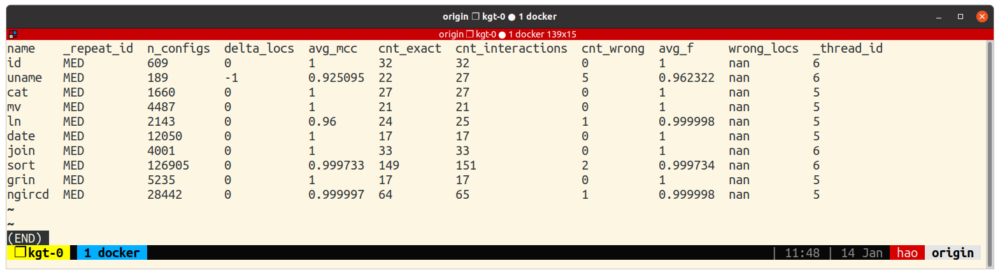

# GenTree

**Note: The lastest version of this artifact package could be found at https://github.com/unsat/gentree/tree/submit_icse21_artifact**

This artifact contains an implementation of the GenTree algorithm and benchmark programs, as described in the paper:
> KimHao Nguyen and ThanhVu Nguyen. 2021. GenTree: Using Decision Trees to Learn Interactions for Configurable Software. In International Conference on Software Engineering.

The full paper could be found here: [gentree-icse21.pdf](https://github.com/unsat/gentree/releases/download/submit_icse21/gentree-icse21.pdf).

# Benchmark

**1. Setup and run the Docker container** as described in INSTALL.pdf file.

**2. Choose the benchmark suite:**
   - **fast**:
     - Run only `id, uname, cat, mv, ln, date, join, vsftpd`.
     - Takes ~3 mins on an Intel Core i9-9880H 8-core @ 2.30GHz laptop with 64GB RAM.
   - **all**:
     - Run all benchmarks.
     - Takes ~26 hours on an AMD Ryzen Threadripper 3990X 64-core @ 2.9 GHz workstation with 64GB RAM.

**3. Run benchmark:**
```bash
cd ~/gentree/wd

# Check that GenTree is working properly.
# The output should look similar to the one listed in INSTALL.pdf file.
# If got "Permission error", run `sudo chmod 777 -R /mnt/ramdisk` and try again.
./gt -J2 -cx -GF 2/id

# Clean up old results
./scripts/bm.sh --clean

# If you want to run the "fast" benchmark suite.   ~3 mins on i9-9880H.
./scripts/bm.sh --fast --bm
# Or if you want to run the "all" benchmark suite. ~26 hours on Ryzen 3990X.
./scripts/bm.sh --all --bm
```

**4. Analyze data:**
```bash
# Run analysis for Table II, III
# "fast" benchmark suite: ~5s  on i9-9880H.
# "all"  benchmark suite: ~60s on Ryzen 3990X.
./scripts/bm.sh --all --analyze-all

# Run analysis for Fig 8 (optional, ~30 mins on Ryzen 3990X).
./scripts/bm.sh --all --analyze-progress
```

**Note:** If you encounter "Duplicated expression" error while running analysis, run
`./scripts/bm.sh --bm --keep-cachedb ls` (replace `ls` by the name of the failed program, most likely `sort` or `ls`). The root cause was because Z3 sometimes simplifies incorrecly a complex formula at the final stage. The command above runs GenTree again using the same traces (coverage information) as the previous runs.

**5. Check results:**
```bash
./scripts/viewcsv.sh res/Analyze/mcc
```

If everything works correctly, the command above should show something similar to the picture.

# Interpret data

**General notes:**
- `./scripts/viewcsv.sh` allows using arrow keys (up/down/left/right) to navigate a pretty-printed .csv file. Press `q` to exit.
- Each benchmark program is run 11 times with different seeds. The result presented in the paper is the median values from those runs.
- The GenTree implementation and benchmark programs has some undetermistic components, so sometimes your results may not match exactly with the results in the paper. However, most of the time, they should be close or match exactly.

## Table II
```bash
# Detailed view of one benchmark. Replace `id` by the desired program name.
./scripts/viewcsv.sh res/Analyze/stat/id.csv

# Summary view of all benchmarks
./scripts/viewcsv.sh res/Analyze/stat
```
| column       | Table II column      | Desciption                                  |
| ------------ | -------------------- | ------------------------------------------- |
| n_configs    | configs              | # of configs used                           |
| n_locs       | cov                  | # of locations found                        |
| t_search     | time(s) / search     | time used by GenTree algorithm              |
| t_total      | time(s) / total      | total time (incl. time to collect cov info) |
| cnt_singular | inter. type / single | # of singular interactions                  |
| cnt_and      | inter. type / conj   | # of conjunctive interactions               |
| cnt_or       | inter. type / disj   | # of disjunctive interactions               |
| cnt_mixed    | inter. type / mix    | # of mixed interactions                     |
| cnt_total    | inter. type / total  | # of all interactions                       |
| max_len      | inter. len / max     | max interaction len                         |
| median_len   | inter. len / median  | median interaction len                      |

```bash
./scripts/viewcsv.sh res/Analyze/cmin MIN
```
| column | Table II column | Desciption                                      |
| ------ | --------------- | ----------------------------------------------- |
| min_c  | min cspace      | size of the minimal covering configurations set |

## Table III
```bash
./scripts/viewcsv.sh res/Analyze/mcc
```
| column           | Table III(a) column | Desciption                                              |
| ---------------- | ------------------- | ------------------------------------------------------- |
| delta_locs       | cov delta           | difference between # of found locations and groundtruth |
| cnt_exact        | inter. / exact      | number of exact interactions compared to groundtruth    |
| cnt_interactions | inter. / total      | total # of interactions                                 |
```bash
./scripts/viewcsv.sh res/Analyze/stat_full
```
| column       | Table III(b) column | Desciption                                      |
| ------------ | ------------------- | ----------------------------------------------- |
| cnt_pure     | pure                | # of pure interactions                          |
| cnt_mix_ok   | mixed / ok          | # of mixed interactions can be found by iGen    |
| cnt_mix_fail | mixed / fail        | # of mixed interactions cannot be found by iGen |

## Figure 8
```bash
# Progress of GenTree algorithm
./scripts/viewcsv.sh res/Analyze/progress/gentree/id.csv

# Progress of randomized algorithm
./scripts/viewcsv.sh res/Analyze/progress/rand/id.csv
```
- Exact interactions (Vertical axis) = cnt_exact / cnt_interactions
- Configurations (Horizontal axis) = n_configs / MAX(n_configs)
